# NCAAF Data Collection — Weekly Build in Public

**Product:** NCAAF live game data collection console  
**Live demo:** https://ncaaf-data-collection.vercel.app  
**Repository:** GitHub (auto-deployed to Vercel on each change)  
**Period covered:** 16 June 2026 – 12 July 2026  
**Last updated:** 7 Jul 2026 (snapshots synced automatically)

---

## Overview

This document is a week-by-week record of the NCAAF Data Collection prototype — a mobile web app built for live game operators who need to manage clock, scoreboard, and risk state from a phone or tablet at the sideline. Work started from a blank repository on 16 June 2026 and progressed through four active development weeks, with each push to GitHub triggering an automatic deploy to Vercel so stakeholders can try changes on a real device within minutes.

The prototype is intentionally demo-driven today: fixtures, scores, and play-by-play events use in-memory sample data rather than a live backend. That lets us validate layout, interaction design, and operator workflows on iPhone and landscape mobile before wiring up production APIs. Week 1 also included upfront product design work — a requirements phasing spreadsheet and Figma prototypes for mobile-first responsive components — that is not reflected in git history but shaped what was built. This write-up is structured for a **build in public** audience — what shipped each week, why it mattered, and where the product stands now.

---

## Executive summary

We built a mobile-first NCAAF data collection prototype from scratch in four weeks of active development. The app lets operators select a fixture, take control of a live game console, manage the clock and scoreboard, toggle risk flags, and review an action log — optimised for landscape and portrait phones, installable as a PWA, and configurable via deployable feature flags.

Development moved in a clear arc: first map requirements and explore responsive layout in Figma, then establish the three-panel game console and deployment pipeline, then add operator-grade clock and period controls, then open up remote feature configuration, and finally polish the fixtures list and portrait iPhone experience. The heaviest weeks were Week 1 (foundation) and Week 3 (game logic), with Week 4 focused on real-device testing feedback from iPhone users.

| Week | Dates | Theme | Highlights |
|------|-------|-------|------------|
| 1 | 16–22 Jun 2026 | Foundation | Requirements phasing spreadsheet, Figma mobile-first exploration, app scaffold, three-panel game console, PWA, Vercel deploy pipeline |
| 2 | 23–29 Jun 2026 | Config groundwork | Feature flags panel polish |
| 3 | 30 Jun–5 Jul 2026 | Game logic & platform | Clock editor, period flow, field direction, feature flag deploy, error toasts |
| 4 | 6–12 Jul 2026 | Fixtures & mobile | Filters, pull-to-refresh, portrait layout, iOS fixes |

**Total:** ~154 commits · React + Vite + TypeScript · shadcn/ui · Zustand

### UI evolution (snapshots)

Automated Playwright captures at each week-end git commit live in [`docs/ui-snapshots/`](./ui-snapshots/README.md). Re-run with `npm run capture:and-sync` to refresh PNGs and regenerate the sections below.

<!-- AUTO-SNAPSHOTS:ui-evolution:START -->
| Week | Fixtures (portrait) | Game (landscape) |
| --- | --- | --- |
| Week 1 | 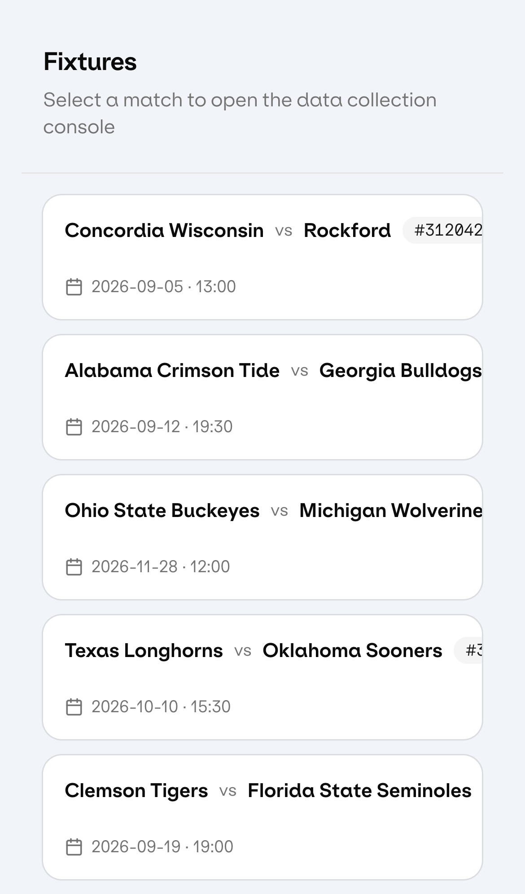 | 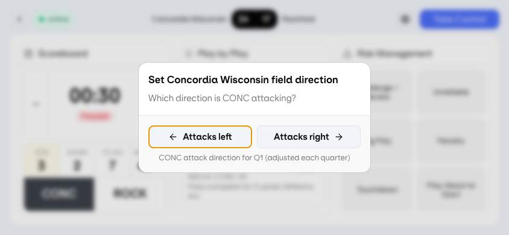 |
| Week 2 |  |  |
| Week 3 |  | 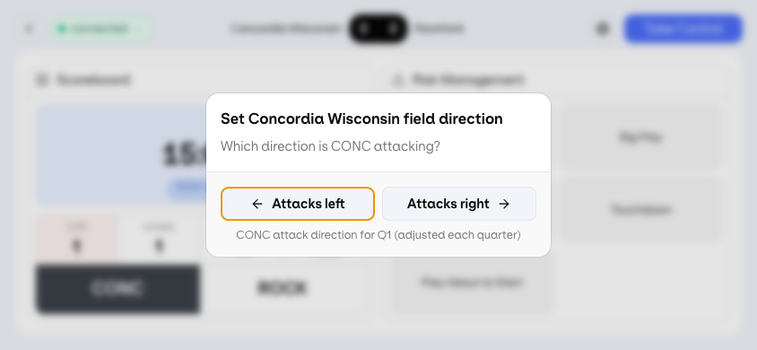 |
| Week 4 | 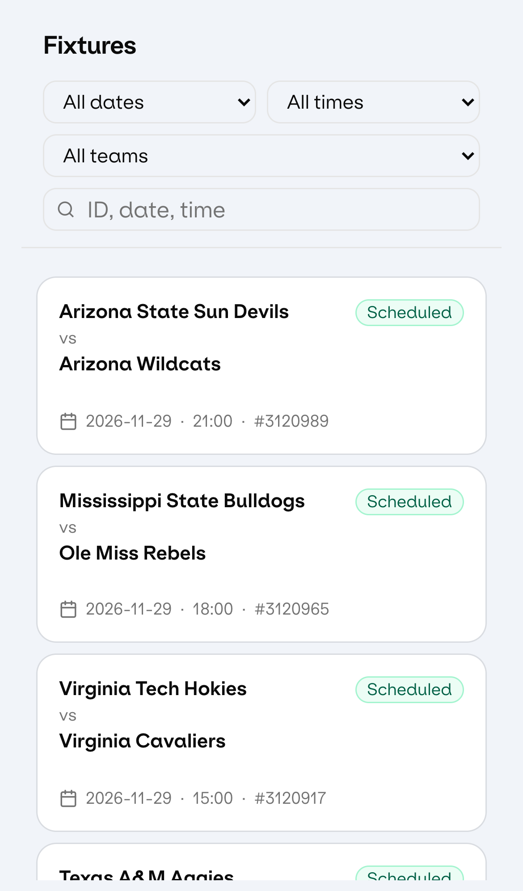 | 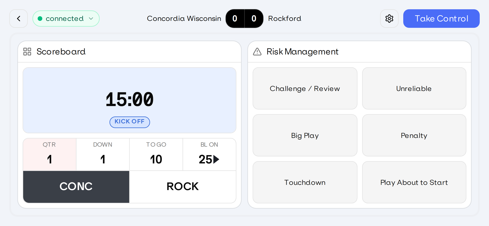 |
<!-- AUTO-SNAPSHOTS:ui-evolution:END -->

---

## Week 1 — 16 to 22 June 2026

**Theme:** From zero to deployable prototype

### Overview

Week 1 combined product planning, design exploration, and rapid prototyping in code. Before and in parallel with development, a **requirements spreadsheet** mapped every capability to a delivery phase — clarifying what belonged in the first prototype versus later iterations. In **Figma**, key screens and components were built out to test how a **mobile-first, responsive** layout would behave across phone orientations and panel sizes, especially for the three-panel game console on a small landscape viewport.

That design work informed what went into the repository: a landscape-mobile data collection console with three side-by-side panels (scoreboard, play-by-play, risk management), a fixtures picker, and the signature “Take Control” operator mode with its red visual state. Alongside the UI, we invested early in installability (PWA), safe-area handling for notched iPhones, and a repeatable deploy path so every Cursor session could ship to Vercel without manual steps.

By the end of the week, a reviewer could add the app to their home screen, open the Concordia vs Rockford demo fixture, pause the clock, toggle risks, and export an action log — the core loop the product is built around.

### Shipped

**Discovery & design (pre-code / parallel to build)**
- **Requirements phasing spreadsheet** — full mapping of product requirements to delivery phases (what to build now vs later)
- **Figma exploration** — screens and components prototyped to validate mobile-first responsive behaviour before implementation
- Tested how panels, headers, and controls reflow or stack on small viewports; findings carried into the React layout and `landscape-mobile` breakpoint strategy

**Application foundation**
- React + Vite + TypeScript app with Tailwind CSS and shadcn/ui component library
- Custom design system: Klarheit Kurrent font, brand colours, panel styling
- Dual UI approach (custom + shadcn variants) with toggle for dev comparison
- Routing: Fixtures list → Game console per fixture
- Zustand state management for games, fixtures, and operator actions

**Fixtures screen**
- List of matches; tap any fixture to open the game console
- Demo fixture: Concordia Wisconsin vs Rockford with sample data

**Game console (landscape mobile)**
- **Scoreboard panel** — game clock, quarter, down/distance, ball-on, possession, score
- **Play-by-play panel** — live feed grouped by quarter, newest events first
- **Risk management panel** — toggle chips for challenge, stat delay, big play, penalty, touchdown, play about to start, etc.

**Core interactions**
- **Take Control** — operator override mode with red border/background; confirmation before activating
- **Clock** — tap to pause/start; ±1 second adjustment; visual pause state (faint red background)
- **Risk toggles** — tap to activate/deactivate individual risk flags
- **Play-by-play simulation** — events generated as clock runs; pulse highlight on new entries; quarter-start events

**Action log & audit**
- All operator actions recorded with game clock timestamp
- Action log dialog with CSV export

**Mobile & PWA**
- Optimised for landscape mobile (`landscape-mobile` breakpoint)
- Web app manifest, Apple touch icons, service worker
- Add to Home Screen support (standalone mode without Safari chrome)
- Safe-area padding for iPhone notch / Dynamic Island
- Landscape notch-side padding detection

**Deployment & tooling**
- GitHub repository connected to Vercel
- SPA routing fix (no 404 on refresh)
- Cursor auto-commit hook → push to GitHub → Vercel auto-deploy
- GitLab remote explored for Genius Sports org; workflow standardised on GitHub + Vercel
- Vercel commit author email fix for successful deployments

**UI polish**
- Panel borders on all three game containers
- Centred header layout for team names and score
- Expanded dummy fixture dataset
- Clock behaviour: 15:00 on new quarter; 00:30 on prototype reset
- Take Control mode no longer shifts layout sizes

### Technical notes
- ~65 commits this week
- ~47 files touched; net +2,034 / −737 lines vs initial commit

<!-- AUTO-SNAPSHOTS:week-1:START -->
### UI snapshots

Commit `1cbc5bb` (7 Jul 2026).

| Fixtures (portrait) | Fixtures (landscape) | Game (portrait) | Game (landscape) |
| --- | --- | --- | --- |
|  |  | 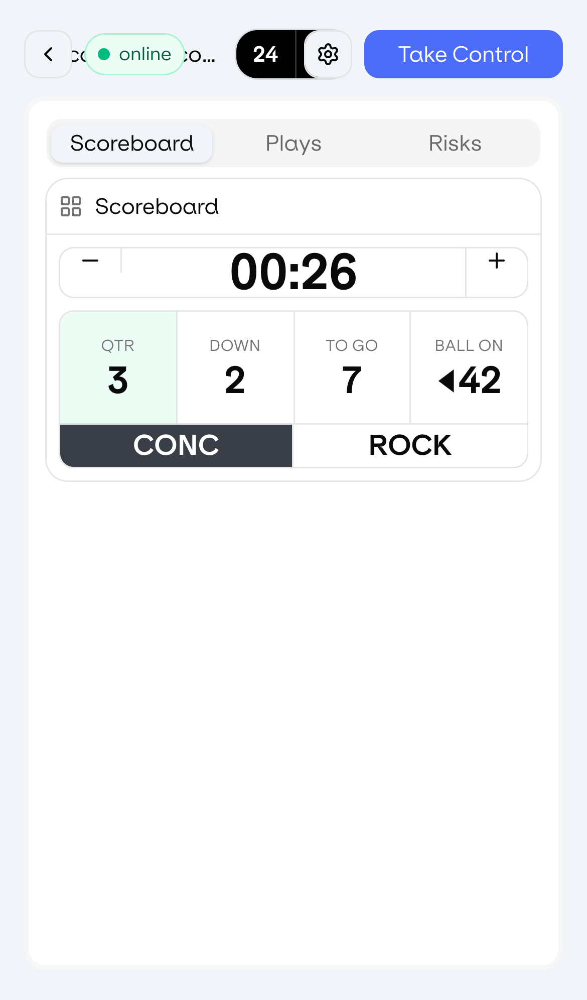 |  |

### Feature highlights

| Take Control confirmation | Take Control active state | Action log |
| --- | --- | --- |
| 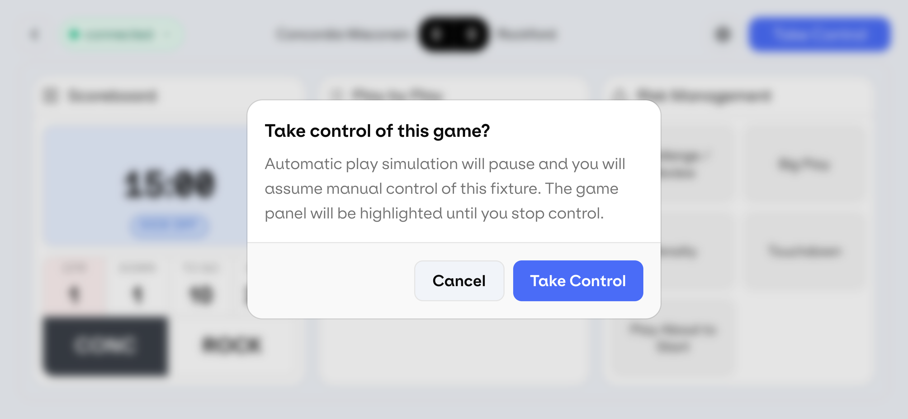 | 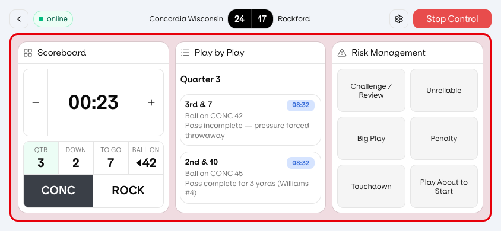 | 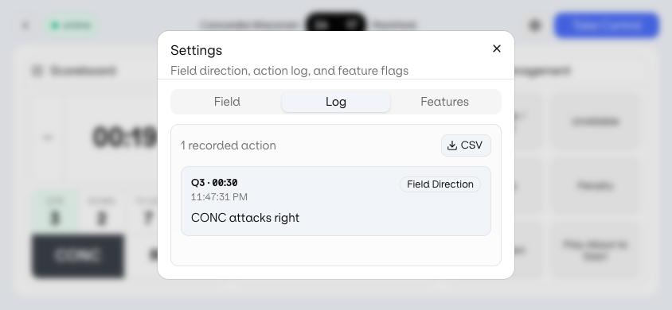 |

| Risk toggle (Challenge / Review) | Clock pause and ±1 second adjust |
| --- | --- |
| 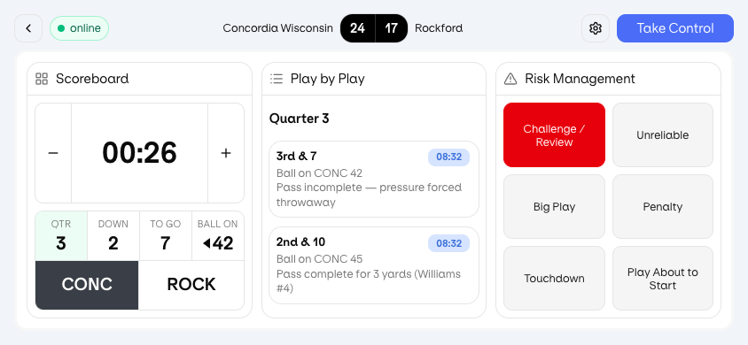 | 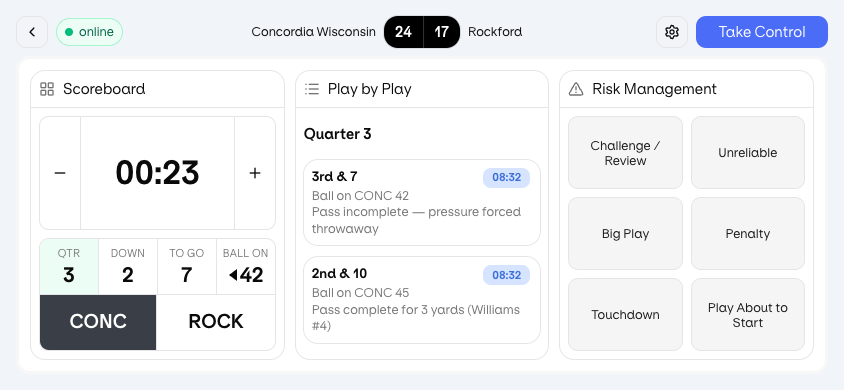 |
<!-- AUTO-SNAPSHOTS:week-1:END -->

---

## Week 2 — 23 to 29 June 2026

**Theme:** Feature configuration groundwork

### Overview

Week 2 was a shorter iteration cycle with only a handful of commits. The main focus was preparing a **feature flags** panel inside Settings so product and engineering could turn panels and behaviours on or off without code changes — a requirement that became critical once stakeholders wanted to demo different configurations (e.g. hide play-by-play, show connection status) to different audiences.

Work this week was mostly wiring and UI polish on the flags panel and its connection to app bootstrap. The full flag catalogue, deploy-to-Vercel flow, and published defaults landed in Week 3.

### Shipped

- Refinements to the **Feature Flags panel** in Settings (UI tab)
- Updates to action log dialog and feature flag store wiring
- Minor integration fixes in app bootstrap (`main.tsx`)

### Notes
- Quiet week in terms of commits (4 total); larger feature-flag architecture landed in Week 3
- Focus was stabilising the flags UI before adding deploy capability

<!-- AUTO-SNAPSHOTS:week-2:START -->
### UI snapshots

Commit `615f79c` (7 Jul 2026).

| Fixtures (portrait) | Fixtures (landscape) | Game (portrait) | Game (landscape) |
| --- | --- | --- | --- |
|  | 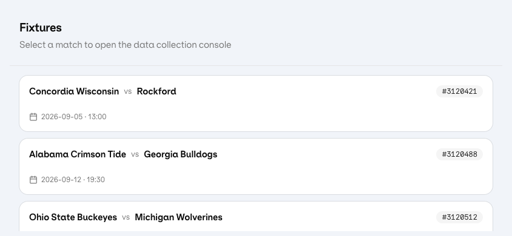 |  |  |

### Feature highlights

| Feature flags panel |
| --- |
| 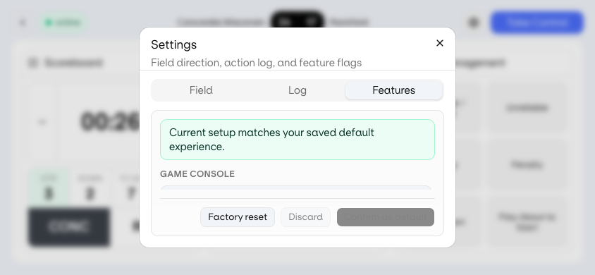 |
<!-- AUTO-SNAPSHOTS:week-2:END -->

---

## Week 3 — 30 June to 5 July 2026

**Theme:** Production-grade game controls and remote configuration

### Overview

Week 3 was the largest functional leap: the scoreboard went from a simple pause/adjust clock to a full **period lifecycle** (kick off, end period, start next period, overtime, end game) with iOS-style wheel editing and confirmation steps for destructive actions. We also added **field direction** — operators must set which way the home team attacks on first open, which drives the ball-on arrow and flips each quarter — and shipped a **feature flag deploy pipeline** so confirmed flag changes update the live Vercel app for all users via a published JSON defaults file.

Supporting work included the connection status chip, fixture-scoped error toasts, a consolidated Settings dialog (Log / Field / UI tabs), and retiring the dual custom/shadcn UI toggle in favour of shadcn-only. This week established most of the behaviour operators would expect from a real collection tool, even though data remains mocked.

### Shipped

**Feature flags system**
- 20+ flags across five groups: Game Console, Header, Scoreboard, Risk Management, Settings
- Settings → UI tab: toggle any panel, header element, scoreboard behaviour, or risk type
- Parent/child flag dependencies (e.g. scoreboard sub-flags require scoreboard panel)
- Settings gear always available (cannot be hidden by accident)
- **Deploy to Vercel:** confirm changes with passphrase → updates `feature-flag-defaults.json` for all users
- Serverless API (`/api/deploy-feature-flags`) + dev middleware
- Recovery via `?resetFeatureFlags` URL parameter
- Published defaults: play-by-play hidden by default; connection status configurable

**Field direction & ball-on**
- First-open dialog: set which direction the home team attacks
- Ball-on arrow reflects attacking direction and possession
- Arrow direction flips each quarter (NCAAF end swaps)
- Field direction editable later in Settings → Field tab
- Styled to match Take Control confirmation pattern

**Scoreboard & clock overhaul**
- **Clock wheel editor** — iOS-style scroll pickers for period · minutes : seconds
- Tap clock → edit with Cancel / Confirm
- Tap elsewhere in clock area → pause or start
- **Full period lifecycle:**
  - KICK OFF (pre-game)
  - END PERIOD when clock reaches 0:00
  - START PERIOD after period ended
  - End-of-regulation choice: start overtime or end game
  - END GAME in overtime
  - MATCH ENDED display when game finished
- Pause/Start chip always visible
- Cancel/Confirm confirmation for end period, end game, and start overtime
- Quarter status cell colour coding (feature-flagged)
- Clock editor capped at 15 minutes

**Connection status**
- Chip beside back button with dropdown statuses:
  - Heartbeat
  - Match State Platform
  - Remote Data Store

**Error toast**
- Top-right notification: red background, alert icon, swipe to dismiss (up or right), close button
- Only appears at fixture level after field direction is set
- Animated enter/exit

**Settings dialog**
- Log button replaced with Settings (gear icon)
- Tabs: **Log** | **Field** | **UI**
- Consistent dialog height across all tabs
- Action log entry styling improvements

**UI consolidation**
- Removed custom/shadcn toggle — **shadcn-only** going forward
- Simplified codebase; single UI variant in production

**DevOps**
- Auto-deploy hook fix when GitHub CLI credential helper unavailable (macOS keychain fallback)

### Technical notes
- ~53 commits this week
- ~30 files touched; net +1,996 / −304 lines
- Key new modules: `ClockWheelEditor`, `ConnectionStatusChip`, `ErrorToastHost`, `featureFlagDeploy`, `api/deploy-feature-flags`

<!-- AUTO-SNAPSHOTS:week-3:START -->
### UI snapshots

Commit `dd1f58f` (7 Jul 2026).

| Fixtures (portrait) | Fixtures (landscape) | Game (portrait) | Game (landscape) |
| --- | --- | --- | --- |
|  |  | 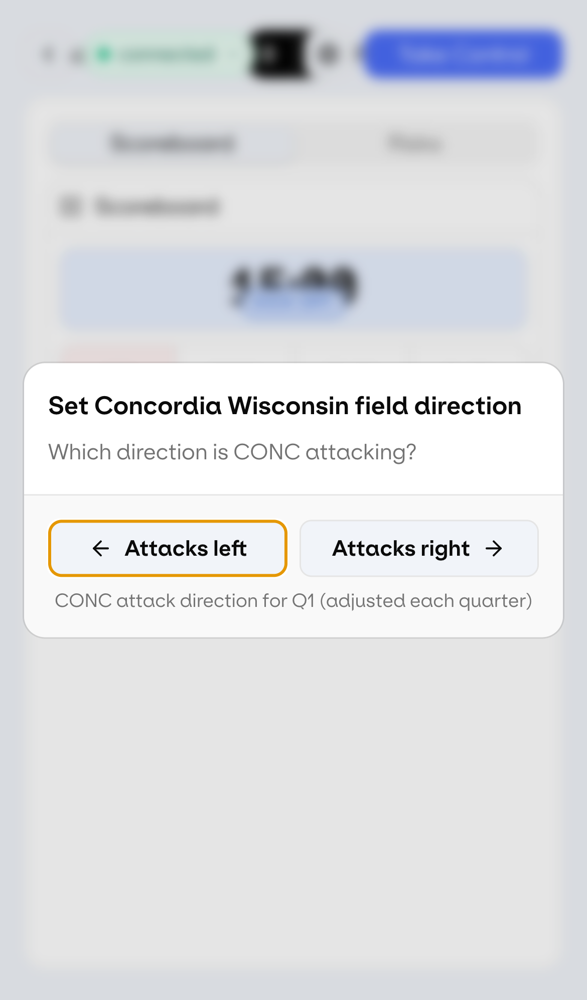 |  |

### Feature highlights

| Field direction dialog (first open) | Clock wheel editor | Connection status chip |
| --- | --- | --- |
|  | 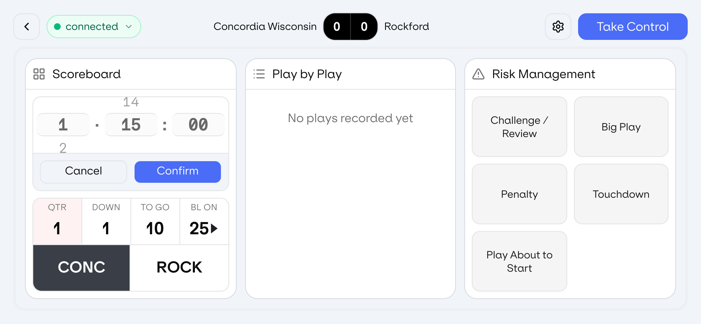 |  |

| Fixture error toast | Settings dialog (Log / Field / Features) |
| --- | --- |
| 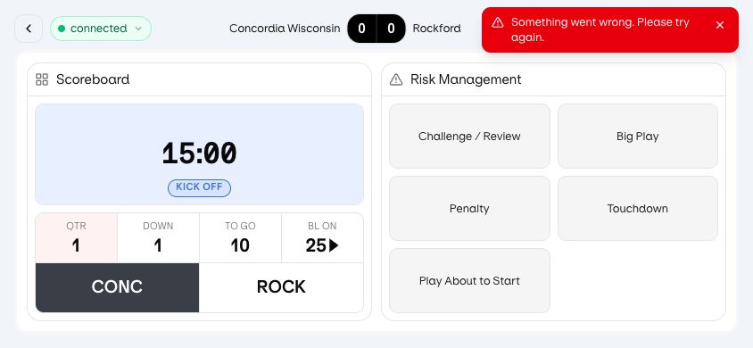 | 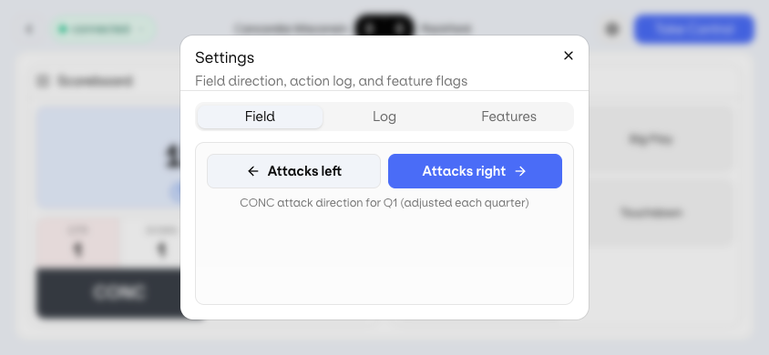 |
<!-- AUTO-SNAPSHOTS:week-3:END -->

---

## Week 4 — 6 to 12 July 2026

**Theme:** Fixtures experience and portrait iPhone readiness

### Overview

Week 4 shifted attention from the game console to the **fixtures entry point** and to **portrait iPhone** usage — feedback showed operators often hold the phone vertically and need to find the right match quickly. We rebuilt the fixtures page with filters, unified search, scheduled/past status chips, pull-to-refresh, and sensible sort order (upcoming fixtures first). Past fixtures now open in a post-match state with final scores and em-dash placeholders on live stat cells, mirroring what collectors see after ending a game.

On the game page, portrait mode dropped tabs in favour of a vertical stack of panels, reworked the header for thumb reach, separated clock from action chips to prevent mis-taps, and fixed several iOS-specific issues including a blank-screen regression and clock editor layout overlap. Most of this work landed in a concentrated session on 7 July, with live Vercel verification on device.

### Shipped

**Fixtures page**
- **Filters:** start date, start time, team (alphabetised dropdown), fixture ID — all derived from fixture data
- **Unified search** — one search box for teams, times, dates, and IDs
- Filters and search on a single compact row; responsive grid on mobile
- **Status chips:** green “Scheduled” for upcoming; neutral for past fixtures
- **Sort order:** furthest-ahead fixtures at top
- **Past fixtures** added to demo data with final scores
- **Post-match state:** opening a past fixture loads ended-game view (same as operator ending a game)
- **Pull-to-refresh** with success toast (“Fixtures list refreshed”)

**Match-ended scoreboard behaviour**
- Final scores on past fixtures
- QTR, DOWN, TO GO, BL ON show em dash (—) when match ended
- No possession indicator when match ended
- Reusable logic for all match-ended states

**Portrait mobile — game page**
- Removed tabs on portrait; scoreboard, play-by-play, and risks **stack vertically**
- **Header layout (portrait):**
  - Row 1: back + connection chip | settings + take control
  - Row 2: home · score · away
- Clock and action chips on separate rows (no accidental clock tap)
- Panels fill vertical space with visible borders
- Stat cells resized for small screens (no text clipping)
- Possession buttons: corner rounding matches container (home = bottom-left, away = bottom-right)

**iOS & PWA fixes**
- Prevent page rubber-banding / swipe on iPhone
- Unified background colour (`#f1f4f9`) across app, theme-color, and manifest
- **Blank screen fix** on iPhone (layout regression from scroll-lock CSS)
- App loads even if feature-flag fetch fails offline
- Verified live deployment on Vercel

**Clock editor (portrait)**
- Wheel picker initialises to current period/time on open
- Fixed layout: picker no longer overlaps Cancel / Confirm buttons (fixed 84px viewport height)

### Technical notes
- ~32 commits this week (heavy session 7 July)
- ~26 files touched; net +1,507 / −365 lines

<!-- AUTO-SNAPSHOTS:week-4:START -->
### UI snapshots

Commit `HEAD` (7 Jul 2026).

| Fixtures (portrait) | Fixtures (landscape) | Game (portrait) | Game (landscape) |
| --- | --- | --- | --- |
|  | 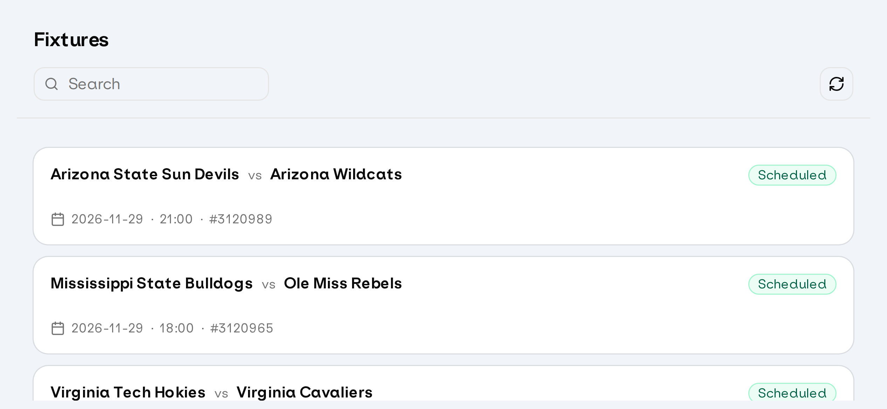 | 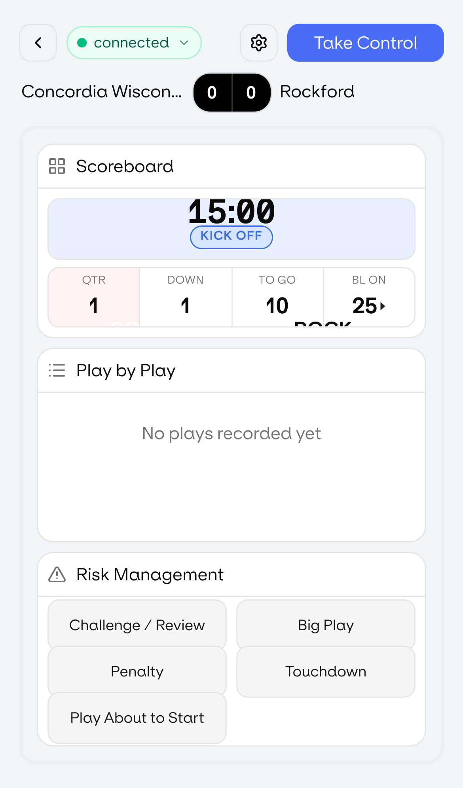 |  |

### Feature highlights

| Fixtures filters and search | Scheduled and past fixture chips | Portrait game console (stacked panels) |
| --- | --- | --- |
| 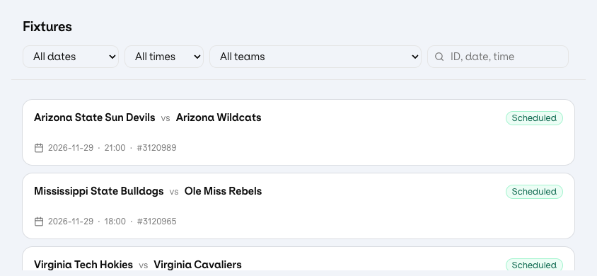 | 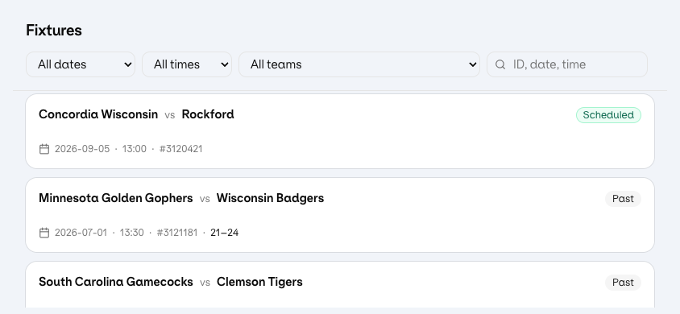 | 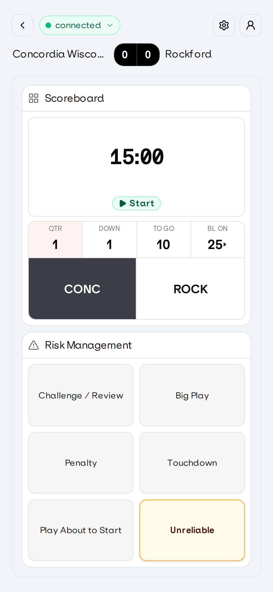 |

| Past fixture match-ended scoreboard |
| --- |
| 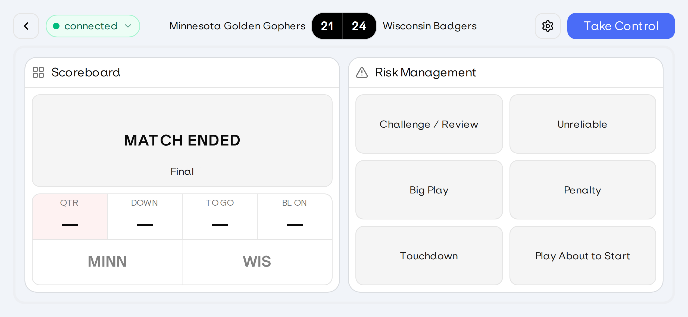 |
<!-- AUTO-SNAPSHOTS:week-4:END -->

---

## Current product capabilities (as of 7 July 2026)

### Overview

The table below is a checklist of what the prototype supports today on the live Vercel build. Items marked complete are implemented and deployable; several depend on feature flags (e.g. play-by-play is built but off by default in published defaults). Nothing in this list implies backend integration — all state is client-side and resets on refresh except deployed feature flag defaults.

| Area | Status |
|------|--------|
| Fixtures list with filters, search, sort, pull-to-refresh | ✅ |
| Scheduled vs past fixture status | ✅ |
| Post-match fixture entry | ✅ |
| Three-panel game console (landscape + portrait) | ✅ |
| Take Control with confirmation | ✅ |
| Clock edit (wheel picker) + pause/start | ✅ |
| Full period / overtime / game-end flow | ✅ |
| Field direction + quarter-end flip | ✅ |
| Risk management toggles | ✅ |
| Play-by-play (feature-flagged, off by default) | ✅ |
| Action log + CSV export | ✅ |
| Feature flags with Vercel deploy | ✅ |
| Connection status chip (feature-flagged) | ✅ |
| Error toast (fixture-scoped) | ✅ |
| PWA / Add to Home Screen | ✅ |
| iPhone portrait + landscape safe areas | ✅ |
| Auto-deploy GitHub → Vercel | ✅ |

---

## Architecture snapshot

### Overview

The app is a single-page React application with no server-side rendering. Game and fixture state live in the browser; the only server interaction today is fetching published feature flag defaults and optionally posting new defaults through the deploy API. This keeps the prototype fast to iterate and easy to host on Vercel, at the cost of no persistence or multi-user sync until a backend is added.

| Layer | Technology |
|-------|------------|
| Frontend | React 19, Vite, TypeScript |
| UI | shadcn/ui, Tailwind CSS v4 |
| State | Zustand |
| Routing | React Router |
| Hosting | Vercel |
| Config | `feature-flag-defaults.json` + deploy API |
| Data | In-memory fixtures & demo plays (no backend API yet) |

---

## Known limitations & follow-ups

### Overview

These are deliberate prototype boundaries or open items identified during the four-week build. They are useful context for anyone evaluating the demo: the UI and flows are largely representative of target operator experience, but data, connectivity, and configuration security are not production-ready yet.

- Demo data only — no live feed or backend integration yet
- Feature flag deploy requires passphrase (not end-user self-service)
- Clock wheel initialisation on iPhone may need further device testing
- Play-by-play simulation is synthetic, not tied to real game events
- Connection status chip is UI-only (no real connectivity check)

---

## How to try it

### Overview

The fastest way to evaluate the build is on a physical phone — especially iPhone in portrait — since much of Week 4’s work targets that form factor. Desktop and landscape mobile also work; the game console was originally designed for landscape sideline use.

1. Open https://ncaaf-data-collection.vercel.app on a phone or desktop
2. On iPhone: Safari → Share → Add to Home Screen for full-screen PWA
3. Select a fixture from the list
4. Set field direction on first open (if enabled)
5. Use Take Control, clock, scoreboard, and risk panels as an operator would

---

*Document generated from git history and development sessions. For internal Confluence: paste this page or import the markdown file. Adjust audience wording as needed for external vs internal “build in public” posts.*
